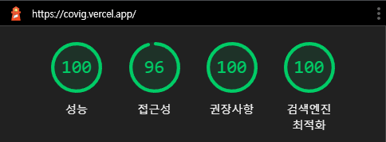

<h1 align="center">Welcome to COVIG 👋</h1>

  
  
  
  

> Covid-19 정보 제공

### 🏠 [~~COVIG으로 이동~~](https://github.com/po4tion/covig-front)

AWS 비용문제로 배포중단했습니다.

## 웹 작동 동영상

[YouTube로 이동](https://www.youtube.com/watch?v=htIcRam5eqA)

 

## Figma 설계

[Figma로 이동](https://www.figma.com/file/nzGvmvaLLitNDiRREsBe6v/Covig-Layout)

 

## Lighthouse 성능 측정

 

## 목차

1. [COVIG](#COVIG)
2. [설명](#설명)
3. [주요 사용 기술](#주요-사용-기술)
4. [배포 환경](#배포-환경)
5. [제공 기능](#제공-기능)
6. [폴더 관리](#폴더-관리)
7. [개발자](#개발자)
8. [제보사항](#제보사항)

 

## COVIG

현재 국내 COVID-19 상황을 한눈에 볼 수 있도록 만든 React 기반의 웹사이트입니다. React, Redux, Chakra UI 그리고 웹사이트 품질과 성능 개선에 집중하여 개발하였습니다. Django 백엔드 개발자와 협업하였고 코드 리뷰와 협업 간 의사소통의 중요성을 알 수 있었던 프로젝트입니다.

 

## 설명

- 행정안전부에서 제공하는 API 사용
- Redux와 Redux-thunk 사용을 통해 상태 관리
- Chakra UI를 통해 웹 UI 전체 페이지 적용
- 다국어(한국어, 영어) 지원
- Chart.js 사용으로 시각적 효과 증가

 

## 주요 사용 기술

- React.js
- Chart.js
- Redux (redux-actions, redux-thunk)
- React-helmet-async
- React-i18next
- Chakra UI

 

## 배포 환경

- Front 배포 환경 : Vercel
- Server 배포 환경 : Aws

 

## 제공 기능

1. 다국어 기능 (ko, en)
2. 다크모드
3. 국내 확진자와 사망자 (일일 / 누적 정보 제공)
4. 지역별 확진자와 사망자 (일일 / 누적 정보 제공)
5. 차트 기능 (1주, 2주, 3주, 한달 정보 제공)
6. 개발자 정보

 

## 폴더 관리

| 폴더명     | 목적                           |
| ---------- | ------------------------------ |
| components | COVIG의 UI / SEO 컴포넌트      |
| i18n       | 다국어 데이터 관리             |
| modules    | Redux 상태 관리                |
| i18n       | 다국어 데이터 관리             |
| pages      | 메인 페이지 관리               |
| utils      | 재사용 가능한 유틸성 파일 관리 |
| public     | images favicon robots          |

 

## 개발자

1. Frontend
   👤 **Kim DongGyu <po4tion0429@gmail.com>**

- Github: [@po4tion](https://github.com/po4tion)

2. Backend
   👤 **Kim KyoungHoon <kkh2826@naver.com>**

- Github: [@kkh2826](https://github.com/kkh2826)

 

## 제보사항

COVIG 이용시 불편사항/불만사항 또는 오류가 발생했을 시 아래 페이지로 제보 부탁드립니다.  [issues page](https://github.com/po4tion/covig-front/issues)
